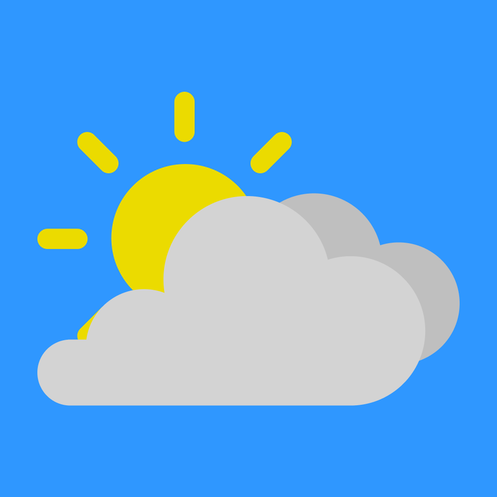

<h1 align="center">
  <a href="https://github.com/marineu/OpenWeatherIos">
    
  </a>
</h1>

# OpenWeatherIos

The application use the [OpenWeather API](https://openweathermap.org/api) to provide weather forecasts by city.

# Screenshots

<p align="center">
  
  
  
  
  
  
</p>

## How to use

Clone this repo to your local machine using:

```
https://github.com/marineu/OpenWeatherIos.git
```

[Create](https://home.openweathermap.org/users/sign_up) a OpenWeather account, navigate to [My API Keys](https://home.openweathermap.org/api_keys) and generate an api key.
Open the ```OpenWeatherIos.xcworkspace``` and put your api key in this file ```Modules/Common/Constants.swift```.<br>
Run!

# Features

- Explore the Current Weather forecast (Real Time)
- Show the 8-day forecast
- Manage the cities for which you want to see the weather forecast
- Change the measurement units

## 📝 License


This project is licensed under the MIT License - see the [LICENSE](LICENSE) file for details.
